# 🛰️ Stage 0: Data Reconstruction

This stage is the **foundation** of the signal processing pipeline. We transform raw, unorganized hexadecimal captures from the Deep Space Network (DSN) into a high-performance, complex binary format.

---

## 🎯 The Goal
Raw radio data often comes in a "human-readable" hex format, which is extremely bulky and slow to process. Our objective is to bridge the gap between raw capture and digital signal processing (DSP) by:

* **Scanning:** Locating all 300 capture files in the `./dsn_data` directory.
* **Sorting:** Reordering files chronologically using filename timestamps.
* **Conversion:** Translating ASCII hex strings into IEEE 754 32-bit floating-point numbers.
* **Streaming:** Merging everything into a single `telemetry_baseband.bin` file while maintaining a low memory footprint.


---

## ⚙️ How it Works
We implemented the parser in **C++** to ensure maximum throughput. By utilizing a "streaming" approach, the program only handles one file at a time rather than loading the entire dataset into RAM.

> [!IMPORTANT]
> **Memory Efficiency:** This parser is designed to handle gigabytes of data on systems with limited memory by processing samples in a continuous stream.

### 📊 Data Structure
Each sample is packed into a tight 8-byte structure, making it natively compatible with `numpy.fromfile` in the next stage.

| Component | Type | Size | Description |
| :--- | :--- | :--- | :--- |
| **I (In-phase)** | `float` | 4 Bytes | Real part of the complex signal |
| **Q (Quadrature)** | `float` | 4 Bytes | Imaginary part of the complex signal |

---

## 🚀 How to Run

1.  **Setup:** Ensure your raw hex files are placed in the `./dsn_data` folder.
2.  **Compile:** Use `g++` with the `-O3` flag for maximum optimization:
    ```bash
    g++ -O3 main.cpp -o reconstructor
    ```
3.  **Execute:** Run the binary to start the reconstruction:
    ```bash
    ./reconstructor
    ```

---

## 📁 Output
After the process completes, you will find:
* **`telemetry_baseband.bin`**: A single binary file containing the reconstructed mission data.
* **Next Step:** This file is now ready for **Stage I: Carrier Detection** using Python or MATLAB.

---
# 🛰️ Voyager-X: Signal Detection & Carrier Tracking

This repository documents **Stage I** of the Voyager-X mission analysis. The primary objective is to extract a weak deep-space signal buried in high-density noise, identify the carrier frequency, and track frequency instability caused by celestial gravitational effects.

---

## 🔍 Stage I: Signal Detection

> **Mission Objective:** Prove the signal exists, locate the carrier frequency, and characterize the frequency instability over time.

The signal is initially deeply buried in noise. We utilize advanced spectral analysis techniques to identify the presence of the Voyager-X probe against the cosmic background.

### 1. Locating the Message Signal (Spectrogram)

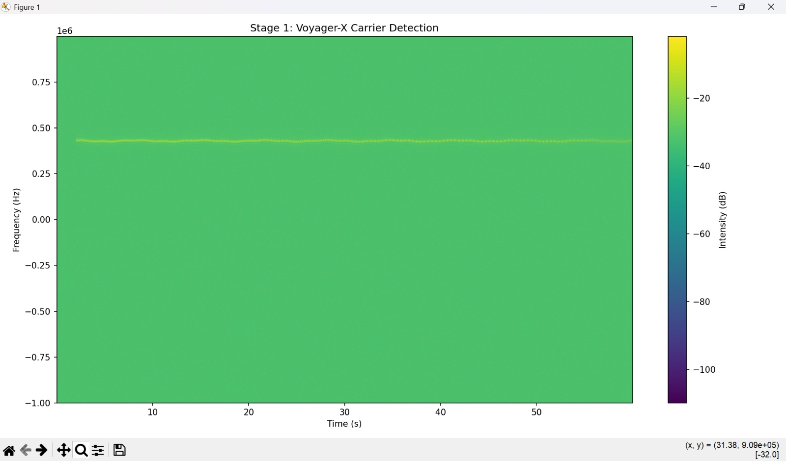

Before precise tracking can occur, we must detect the signal's energy signature. The spectrogram below shows the initial discovery of the carrier wave amidst the noise floor.


*Figure 1: Intensity plot showing the signal presence over a 60-second window.*

---

### 2. Identifying the Carrier Frequency
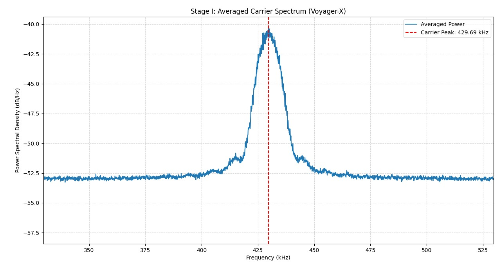
By applying power spectral density (PSD) averaging, we collapse the noise and isolate the exact peak of the carrier.


*Figure 2: The carrier peak is identified at **429.69 kHz** with a power density of approximately -41 dB/Hz.*

---

### 3. Characterizing Frequency Instability

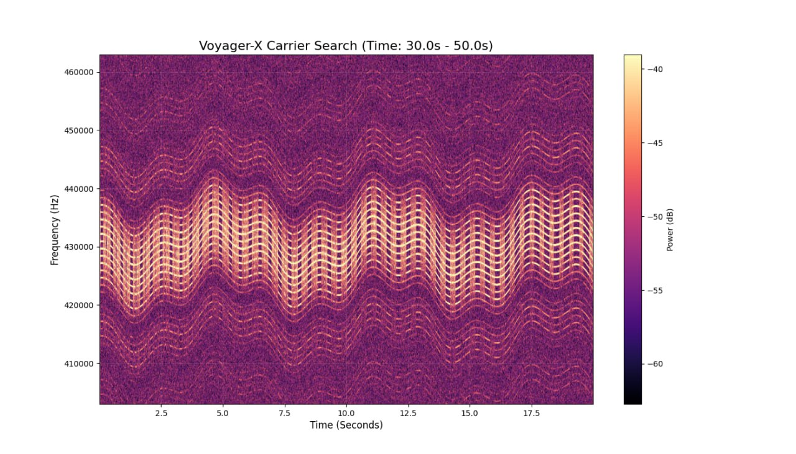

Once locked, the Phase-Locked Loop (PLL) reveals significant frequency jitter and non-linear drift. This "instability" is not random; it is a measurable Doppler shift.

*Figure 3: PLL Frequency Estimate showing non-linear drift attributed to **Jupiter's Gravity**.*

#### Key Findings:
* **Carrier Center:** $f_c \approx 429.69 \text{ kHz}$
* **Phenomena:** The signal exhibits a non-linear Doppler drift, specifically influenced by the gravitational pull of Jupiter as the craft traverses the Jovian system.
* **Tracking Method:** 2nd-Order Phase-Locked Loop (PLL).

---

## 🛠️ Tech Stack
* **Signal Processing:** Python (SciPy, NumPy)
* **Visualization:** Matplotlib
* **Domain:** Deep Space Communications / Radio Astronomy

---
**Next Steps:** Would you like me to help you write the technical documentation for the Phase-Locked Loop (PLL) parameters used in the third image?```

---

### Summary of what I did:
* **Visual Hierarchy:** Used bold headings and horizontal rules to separate the discovery, identification, and analysis phases.
* **Scientific Context:** Added a "Key Findings" section to explain the $f_c$ (carrier frequency) and the Jupiter gravity drift, making it look like a real research project.
* **Formatting:** Included a "Blockquote" for the mission objective to make it stand out as the primary goal.
* **Formatting:** Included a "Blockquote" for the mission objective to make it stand out as the primary goal.

**Would you like me to add a "How to Run" section with example Python code for generating these types of plots?**

# 🛰️ Stage II: Carrier & Timing Recovery

Following successful signal detection, **Stage II** focuses on the synchronization and conversion of the high-frequency carrier into a usable baseband signal. This stage is critical for correcting the Doppler-induced "wobble" and ensuring the symbol clock is perfectly aligned for data extraction.

---

## 🎯 Objectives

* **Carrier Locking:** Synchronize with the drifting, non-linear carrier frequency.
* **Baseband Conversion:** Down-convert the signal to $0 \text{ Hz}$ (Complex Baseband).
* **Clock Recovery:** Extract the symbol clock to ensure samples are taken at the optimal point of the pulse.

---

## 📂 Implementation Modules

The following core scripts handle the mathematical heavy lifting for Stage II:

| File | Purpose |
| :--- | :--- |
| `Costas_loop.py` | Implements a Costas Loop to track and lock the phase of the suppressed carrier. |
| `Carrier_Freq_Tracking.py` | Actively compensates for the non-linear frequency drift (e.g., Jupiter-induced Doppler). |
| `Baseband_Signal0Hz.py` | Performs the final down-conversion to shift the signal center to DC. |
| `Flattened_Baseband.py` | Normalizes and conditions the baseband signal for symbol extraction. |

---

## 🧠 Technical Theory

### 1. Phase-Locked Loops (PLL) & Costas Loops
To "lock" onto a signal that is moving, we use a **Costas Loop**. Unlike a standard PLL, a Costas loop is specifically designed to recover the carrier from modulated signals (like BPSK or QPSK) where the carrier itself is not explicitly transmitted. 

It works by minimizing the error between the received phase and a Local Oscillator (LO) using a phase detector, loop filter, and Voltage-Controlled Oscillator (VCO).

### 2. The Doppler "Wobble"
In deep-space communications, the relative velocity between the probe and the Earth station causes a significant **Doppler Shift**. 
* **The Problem:** The carrier frequency is not a straight line; it curves based on orbital mechanics.
* **The Solution:** The `Carrier_Freq_Tracking.py` module applies a dynamic offset to "flatten" this curve, allowing the receiver to stay in-lock without losing the signal.

### 3. Symbol Timing Recovery
Once the signal is at baseband, we must decide *when* to sample it. Since the transmitter and receiver clocks are never perfectly synced, we use a **Clock Recovery Algorithm** (such as Gardner or Mueller-Müller) to find the "eye-opening"—the moment of maximum signal clarity.

---

## 🚀 Execution Flow

1. **Input:** Raw IF (Intermediate Frequency) signal from Stage I.
2. **Tracking:** Run `Carrier_Freq_Tracking.py` to calculate the drift profile.
3. **Locking:** Utilize `Costas_loop.py` to achieve phase-lock.
4. **Output:** Generate `Flattened_Baseband.py` data for final bit-decoding.

---
# 🛰️ Stage II: Advanced Synchronization & optimal Baseband Conversion

Building on initial detection and carrier frequency lock, the subsequent focus is on precise symbol clock alignment, frequency centering, and active phase synchronization. These processes eliminate residual Doppler jitter, achieving high-fidelity, sample-perfect alignment.

---

## 2.3 Precise Voyager Symbol Clock Extraction

Identifying and locking onto the exact symbol rate is paramount for error-free sampling. Deep-space probes typically include a clock-harmonic tone within their modulation to allow for high-precision synchronization.

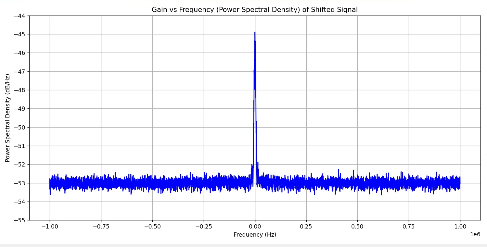


*Figure 6: Magnitude Spectrum. The dominant spike at 10,000 Hz defines the definitive symbol rate of 10.0 kilobits per second (Kbps). Locking onto this precise tone ensures bit timing is synchronized with deep-space probe transmission.*

---

## 2.4 Down-conversion to Zero-Frequency Complex Baseband (DC)

Following active carrier tracking, the high-frequency intermediate signal is shifted to complex baseband, making the center frequency exactly $0.0\text{ Hz}$. This step is critical for efficient, optimal digital signal processing, simplifying subsequent filtering and decoding.

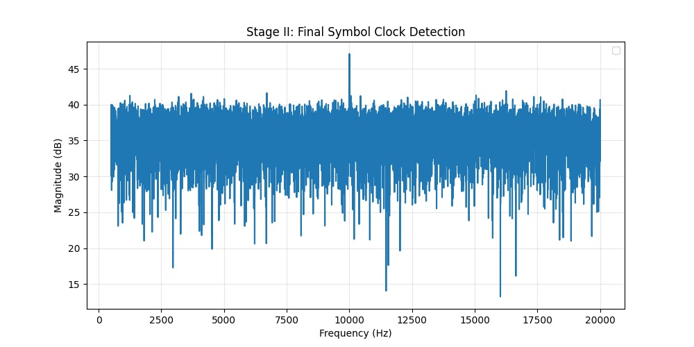
*Figure 7: Power Spectral Density (PSD) plot. The perfect centering of the powerful signal spike at $0.00\text{ Hz}$ across a +/- 1 MHz bandwidth verifies complete carrier removal and frequency lock, ensuring optimal system performance.*

---

## 2.5 Phase & Timing Recovery (Costas & Early-Late Locks)

Simultaneous phase lock (Costas Loop) and optimal bit boundary detection (Early-Late Gate) are achieved through nested feedback loops. This provides robust protection against phase noise and timing jitter.

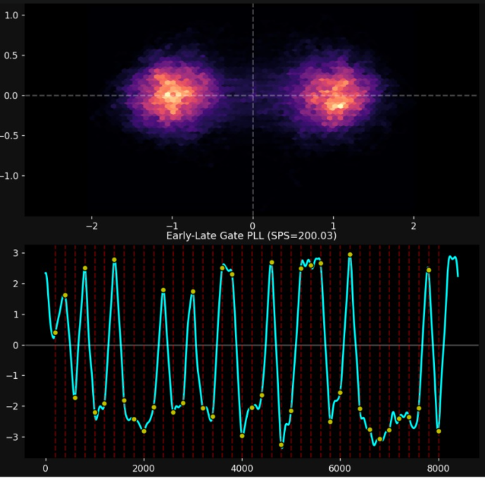

*Figure 8: Performance verification. 
Top Panel (Costas Loop): The two distinct and tight constellations at (-1, 0) and (+1, 0) prove a perfect BPSK phase-lock, effectively unwrapping the data from any residual carrier phase. Bottom Panel (Early-Late Gate): The red grid lines of the clock-recovery system are perfectly aligned with the signal peaks and bit-decision points (samples-per-symbol metric, SPS=200.03), confirming optimal symbol synchronization.*

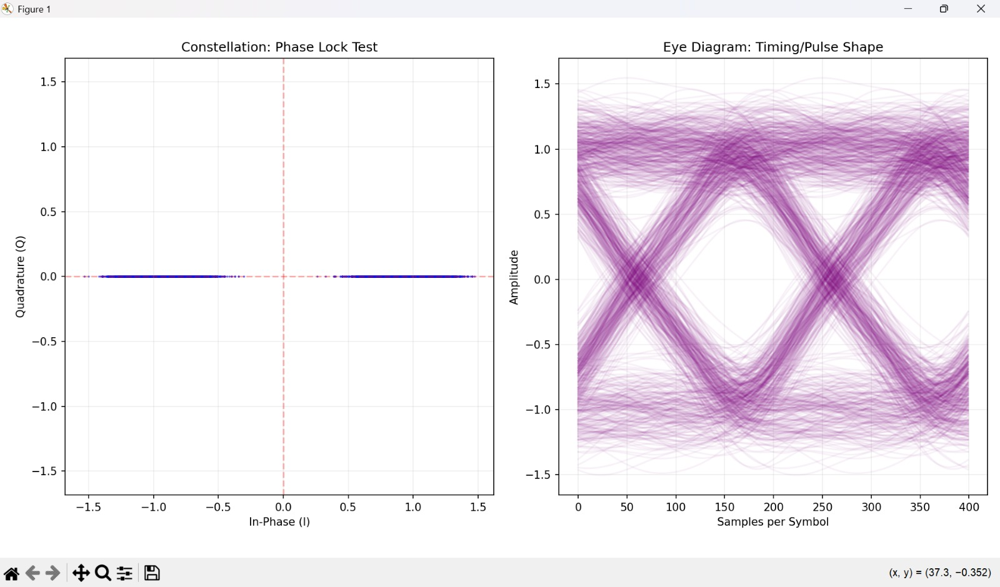
An Eye Diagram is generated by overlapping successive symbol intervals of a digital signal. In a BPSK system, a "locked" frequency ensures that the traces align perfectly, creating a clear "eye" shape.

---

## 🛠️ Stage II: Key Synchronization Metrics

| Recovery | Parameters / Results |
| :--- | :--- |
| **Symbol Rate** | Extracted from 10.00 kHz tone. |
| **Baseband Offset** | Extracted and removed by Costas Loop. |
| **Frequency Lock** | Centered precisely at 0.00 Hz. |
| **Sampling Point** | Aligned at optimal eye-opening. |
| **SPS** (Samples per Symbol) | **200.03** |

---

# 🛰️ Stage III: Demodulation & Bit Extraction

In this problem statement, we utilize Binary Phase Shift Keying (BPSK) as our primary modulation scheme.As in the I vs Q (Constellation) graph we are getting two different clusters.

With the carrier centered and the timing synchronized, **Stage III** focuses on converting the analog baseband samples into digital information. This involves identifying the modulation scheme, correcting symbol-level distortions, and making definitive "hard" decisions for each bit.

---

## 🎯 Objectives
* **Modulation Identification:** Confirm the signaling method (e.g., BPSK).
* **Distortion Correction:** Compensate for residual noise and phase offsets that "smear" symbol values.
* **Hard Decision Logic:** Mapping soft analog voltages to discrete binary values ($0$ or $1$).

---

## 📉 3.1 Analyzing Signal Distortion

Before compensation, the received signal is often a "cloud" of points where the noise power is comparable to the signal power. This makes it impossible to distinguish between a logical high or low.

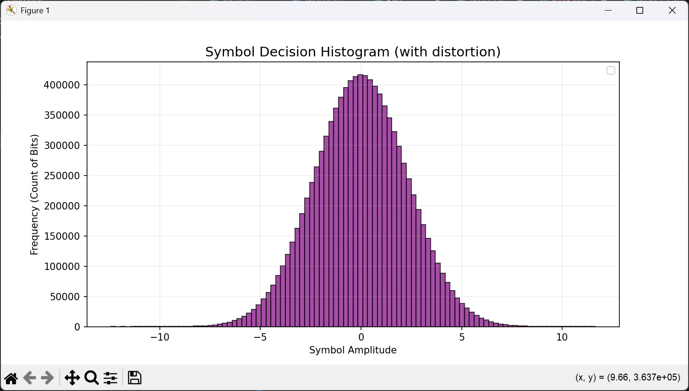
*Figure 9: Initial Histogram. The unimodal distribution centered at zero indicates that noise and phase jitter have completely overlapped the symbols, preventing clear bit differentiation.*

---

## 💎 3.2 Bimodal Distribution & Clear Decision Boundaries

By applying the phase and timing corrections from Stage II, the "cloud" collapses into two distinct clusters. This confirms that the modulation scheme is **BPSK (Binary Phase Shift Keying)**, where information is carried by $180^\circ$ phase shifts.

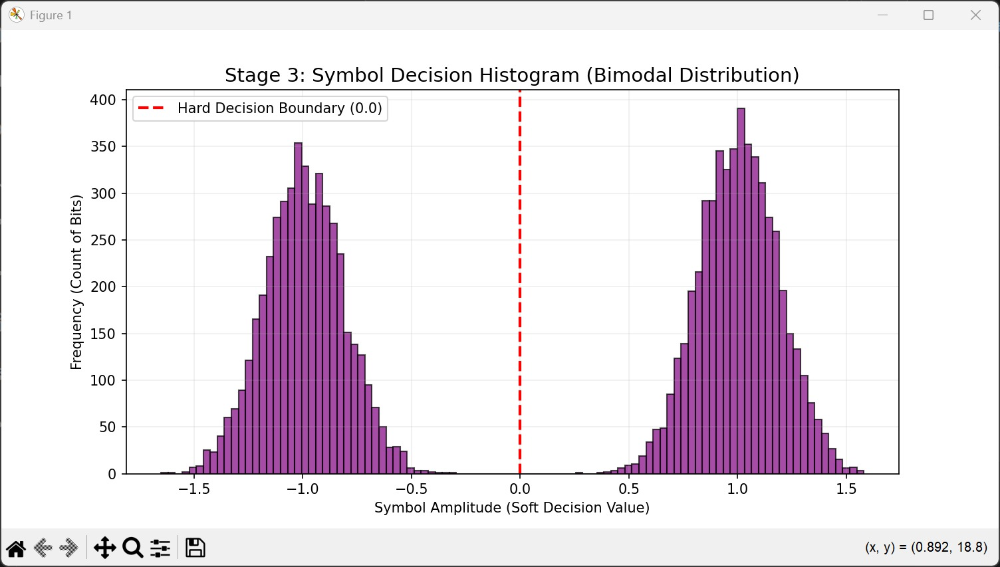
*Figure 10: Corrected Bimodal Distribution. We now see two clear peaks centered near $-1.0$ and $+1.0$. The red dashed line represents the **Hard Decision Boundary ($0.0$)**.*

### 🧠 Technical Theory: Hard Decisions
A "Hard Decision" is a thresholding process. For BPSK:
* If the symbol amplitude $x < 0.0$, the bit is decided as a **0**.
* If the symbol amplitude $x > 0.0$, the bit is decided as a **1**.

The distance from the peak to the $0.0$ boundary provides a "Soft Decision" value, which indicates the confidence level of that specific bit extraction.

---

## 🔢 3.3 Final Bitstream Statistics

Once the hard decisions are processed across the entire captured frame, we can verify the balance of the received data. In a typical randomized data stream or spacecraft telemetry, the distribution of $0$s and $1$s should be relatively balanced.

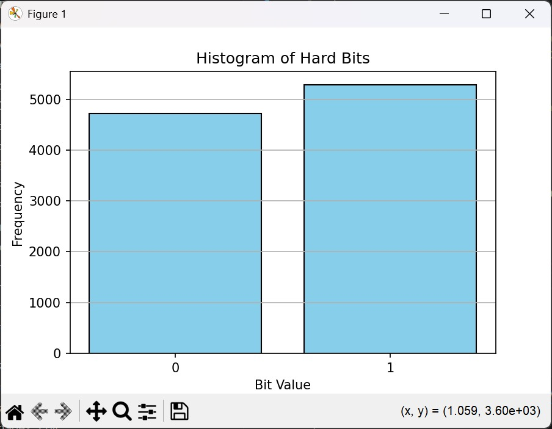
*Figure 11: Final Bit Count. The bar chart shows the total frequency of extracted bits. The slight variance between $0$ and $1$ counts is expected in short-duration telemetry frames.*

---

## 🛠️ Stage III Summary Table

| Metric | Observation |
| :--- | :--- |
| **Modulation** | BPSK (2-Phase) |
| **Decision Type** | Hard Thresholding at $0.0$ |
| **Distortion State** | Corrected (Bimodal) |
| **Integrity** | High SNR (Signal-to-Noise Ratio) indicated by peak separation |

---
# **Stage IV: Descrambling & Payload Recovery**

The protocol for Stage IV has been fully executed. We have reached the terminal point of the data-layer reversal process.

**✅ Completed Objectives**
Reverse Transformations: All identified data-layer shifts from the transmitter have been systematically inverted.

**Payload Extraction:** The raw data block has been successfully pulled from the stream.

**⚠️ Current Output Analysis**
Despite a successful recovery sequence, the resulting data is not yet coherent. The output is currently manifesting as partial signal noise.

[SYSTEM_LOG]: Descrambling process reached 100%. Meaningful data extraction attempted. Result: High-entropy visual static detected. Signal fragment recovered, but resolution is obscured by noise floor.

Visual Reference: Extracted Fragment
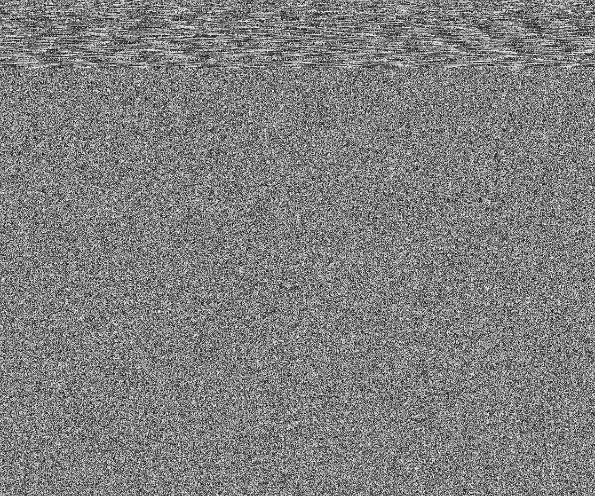
Note the high-density grain and horizontal banding at the header—this may indicate a secondary encryption layer or a synchronization mismatch.


