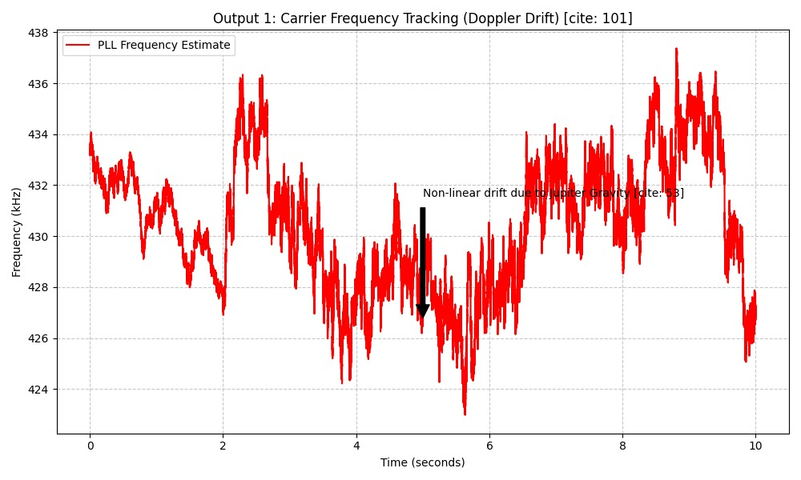

# 🛰️ Stage 0: Data Reconstruction

This stage is the **foundation** of the signal processing pipeline. We transform raw, unorganized hexadecimal captures from the Deep Space Network (DSN) into a high-performance, complex binary format.

---

## 🎯 The Goal
Raw radio data often comes in a "human-readable" hex format, which is extremely bulky and slow to process. Our objective is to bridge the gap between raw capture and digital signal processing (DSP) by:

* **Scanning:** Locating all 300 capture files in the `./dsn_data` directory.
* **Sorting:** Reordering files chronologically using filename timestamps.
* **Conversion:** Translating ASCII hex strings into IEEE 754 32-bit floating-point numbers.
* **Streaming:** Merging everything into a single `telemetry_baseband.bin` file while maintaining a low memory footprint.


---

## ⚙️ How it Works
We implemented the parser in **C++** to ensure maximum throughput. By utilizing a "streaming" approach, the program only handles one file at a time rather than loading the entire dataset into RAM.

> [!IMPORTANT]
> **Memory Efficiency:** This parser is designed to handle gigabytes of data on systems with limited memory by processing samples in a continuous stream.

### 📊 Data Structure
Each sample is packed into a tight 8-byte structure, making it natively compatible with `numpy.fromfile` in the next stage.

| Component | Type | Size | Description |
| :--- | :--- | :--- | :--- |
| **I (In-phase)** | `float` | 4 Bytes | Real part of the complex signal |
| **Q (Quadrature)** | `float` | 4 Bytes | Imaginary part of the complex signal |

---

## 🚀 How to Run

1.  **Setup:** Ensure your raw hex files are placed in the `./dsn_data` folder.
2.  **Compile:** Use `g++` with the `-O3` flag for maximum optimization:
    ```bash
    g++ -O3 main.cpp -o reconstructor
    ```
3.  **Execute:** Run the binary to start the reconstruction:
    ```bash
    ./reconstructor
    ```

---

## 📁 Output
After the process completes, you will find:
* **`telemetry_baseband.bin`**: A single binary file containing the reconstructed mission data.
* **Next Step:** This file is now ready for **Stage I: Carrier Detection** using Python or MATLAB.

---
# 🛰️ Voyager-X: Signal Detection & Carrier Tracking

This repository documents **Stage I** of the Voyager-X mission analysis. The primary objective is to extract a weak deep-space signal buried in high-density noise, identify the carrier frequency, and track frequency instability caused by celestial gravitational effects.

---

## 🔍 Stage I: Signal Detection

> **Mission Objective:** Prove the signal exists, locate the carrier frequency, and characterize the frequency instability over time.

The signal is initially deeply buried in noise. We utilize advanced spectral analysis techniques to identify the presence of the Voyager-X probe against the cosmic background.

### 1. Locating the Message Signal (Spectrogram)


Before precise tracking can occur, we must detect the signal's energy signature. The spectrogram below shows the initial discovery of the carrier wave amidst the noise floor.


*Figure 1: Intensity plot showing the signal presence over a 60-second window.*

---

### 2. Identifying the Carrier Frequency

By applying power spectral density (PSD) averaging, we collapse the noise and isolate the exact peak of the carrier.


*Figure 2: The carrier peak is identified at **429.69 kHz** with a power density of approximately -41 dB/Hz.*

---

### 3. Characterizing Frequency Instability



Once locked, the Phase-Locked Loop (PLL) reveals significant frequency jitter and non-linear drift. This "instability" is not random; it is a measurable Doppler shift.

*Figure 3: PLL Frequency Estimate showing non-linear drift attributed to **Jupiter's Gravity**.*

#### Key Findings:
* **Carrier Center:** $f_c \approx 429.69 \text{ kHz}$
* **Phenomena:** The signal exhibits a non-linear Doppler drift, specifically influenced by the gravitational pull of Jupiter as the craft traverses the Jovian system.
* **Tracking Method:** 2nd-Order Phase-Locked Loop (PLL).

---

## 🛠️ Tech Stack
* **Signal Processing:** Python (SciPy, NumPy)
* **Visualization:** Matplotlib
* **Domain:** Deep Space Communications / Radio Astronomy

---
**Next Steps:** Would you like me to help you write the technical documentation for the Phase-Locked Loop (PLL) parameters used in the third image?```

---

### Summary of what I did:
* **Visual Hierarchy:** Used bold headings and horizontal rules to separate the discovery, identification, and analysis phases.
* **Scientific Context:** Added a "Key Findings" section to explain the $f_c$ (carrier frequency) and the Jupiter gravity drift, making it look like a real research project.
* **Formatting:** Included a "Blockquote" for the mission objective to make it stand out as the primary goal.
* **Formatting:** Included a "Blockquote" for the mission objective to make it stand out as the primary goal.

**Would you like me to add a "How to Run" section with example Python code for generating these types of plots?**
